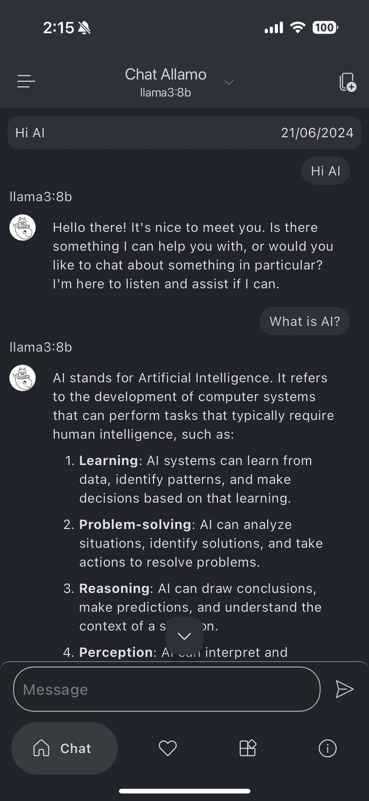
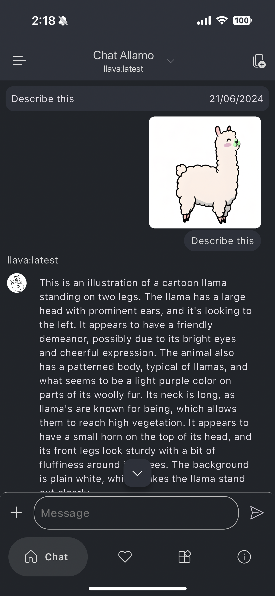
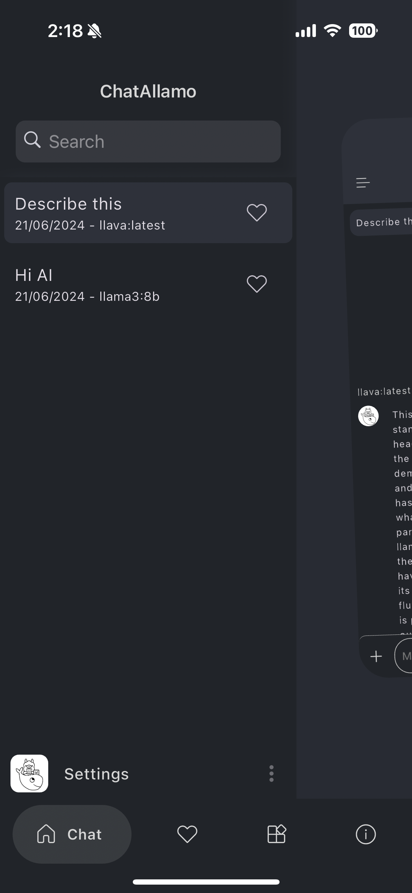
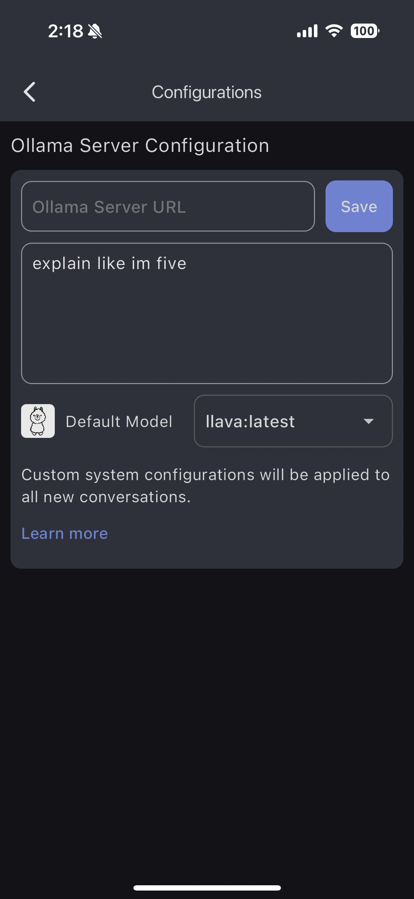
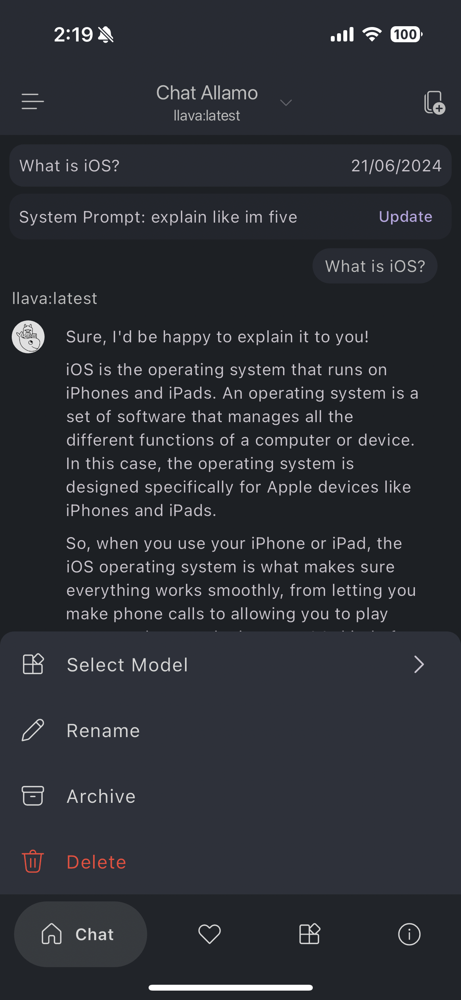
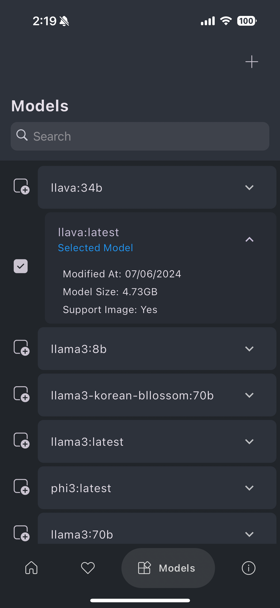

[](https://apps.apple.com/gb/app/enchanted-llm/id6474268307)
[](https://play.google.com/store/apps/details?id=com.jmorganca.ollama)


# ChatAllamo

ChatAllamo, powered by [Ollama](https://github.com/jmorganca/ollama), is a Flutter application, both Android and iOS, designed to facilitate seamless interaction with both provided and privately hosted AI models, including Llama2, Llama3, Mistral, and more.

## Platforms
- [x] Android
- [x] iOS
- [ ] Web (not supported)
- [ ] Desktop (not supported)

## Features
- [x] Generate text from a given prompt
- [x] Stream typing-like animation for generated text
- [x] Abort during generating chat conversation
- [x] List available models and their descriptions
- [x] Switch model in the middle of a conversation
- [x] Local chat history (locally using sqlite)
- [x] Save and load conversations (locally using sqlite)
- [x] Favorite, archive, and delete conversations
- [x] Search conversations based on title
- [x] Upload image to conversation from prompt
- [x] Custom system prompt for generating text
- [x] Markdown support (nicely formatted text)
- [x] Change Ollama server URL customization
- [ ] Store uploaded image locally rather than in Firebase Storage
- [x] Edit prompt content for re-generation
- [ ] Temperature & model options
- [ ] Suggest prompt in empty conversation screen
- [ ] Text to speech (read aloud)
- [ ] Light and dark mode (only dark mode supported)

# Installation

You need to configure the firebase with this project. Follow these links:
- [Firebase](https://firebase.google.com/docs/flutter/setup)
- [FlutterFire](https://firebase.flutter.dev/docs/overview)

These will generate the missing `firebase_options.dart` file in the lib folder. Then you can run the project.
```bash
flutter pub get
flutter run
```

# Usage Instructions

Chat Allamo offers a default Ollama server URL, provided by the author, which you have the option to customize with your preferred server URL. To do so, follow the steps below:
1. Open the Chat Allamo application.
2. Click on hamburger menu (three horizontal lines) on the top left corner.
3. Click on the settings icon (gear icon) on the bottom left corner.
4. Click on the "Configurations" button.
5. Change the "Ollama Server URL" to your own server URL.
6. Click on the "Save" button.
7. Restart the application.

# Known Bugs and Limitations

- The generated text animation sometimes disappears in iOS devices.
- The uploaded image will be stored in Firebase Storage. This raises privacy concerns regarding the image's confidentiality.

# Contacts for Contributions

I am quite new to the Flutter community and would appreciate any contributions to this project. If you have any suggestions or improvements, please feel free to contact me via the following links:

- [Personal Email](mailto:kimleang.rscher@gmail.com)
- [Personal Website](https://www.kkimleang.com)

# Screenshots








<iframe style="width:100%;height:auto;min-width:600px;min-height:400px;" src="https://star-history.com/embed?secret=#KimleangSama/chat-allamo&Date" frameBorder="0"></iframe>

# License and Copyrights

[Apache License 2.0](https://www.apache.org/licenses/LICENSE-2.0)

Copyright (c) 2024, Kimleang Kea. All rights reserved.
